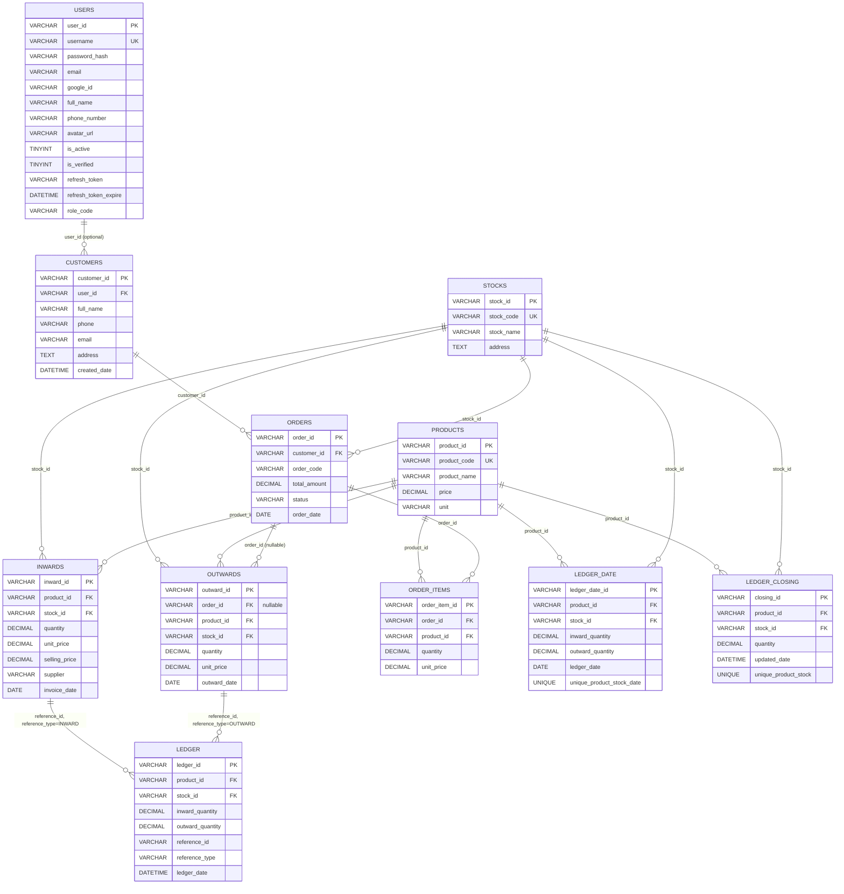

# Data model

Tài liệu này mô tả chi tiết **schema database** của hệ thống, bao gồm 11 bảng trong 2 database MySQL.

## Tổng quan

| Database | Mục đích | Số bảng | Service dùng |
|---|---|---|---|
| `master_db` | Authentication | 1 (`users`) | AuthApi |
| `business_db` | Nghiệp vụ + sổ cái | 10 | BusinessApi, OrderApi, LedgerWorker, VoucherWorker |

Connection string:
- `master_db`: `ConnectionStrings__Default` → `Server=mysql-master;Database=master_db;User=root;Password=P@ssw0rd123;`
- `business_db`: `ConnectionStrings__BusinessConnection` → `Server=mysql-business;Database=business_db;User=root;Password=P@ssw0rd123;`

(Khi chạy qua k8s, password MySQL trên host được set qua `infra/charts/ecom-stack/values.yaml` → `global.localMysql.password`. Mặc định `Mysql!110720`.)

## Sơ đồ ERD



## Chi tiết từng bảng

### 1. `users` (master_db)

Lưu tài khoản đăng nhập.

| Cột | Kiểu | Ràng buộc | Mô tả |
|---|---|---|---|
| `user_id` | VARCHAR(36) | PK | UUID |
| `username` | VARCHAR(100) | UNIQUE NOT NULL | Tên đăng nhập |
| `password_hash` | VARCHAR(255) | | BCrypt hash |
| `email` | VARCHAR(255) | | Email |
| `google_id` | VARCHAR(255) | | Google OAuth ID (nullable) |
| `full_name` | VARCHAR(255) | | Họ tên |
| `phone_number` | VARCHAR(20) | | Số điện thoại |
| `avatar_url` | VARCHAR(500) | | URL avatar |
| `is_active` | TINYINT(1) | DEFAULT 1 | 1 = active, 0 = disabled |
| `is_verified` | TINYINT(1) | DEFAULT 0 | Email verified |
| `refresh_token` | VARCHAR(500) | | JWT refresh token hiện tại |
| `refresh_token_expire` | DATETIME | | Thời hạn refresh token |
| `role_code` | VARCHAR(50) | DEFAULT 'USER' | `USER` hoặc `ADMIN` |
| `created_date` | DATETIME | | Ngày tạo |
| `created_by` | VARCHAR(100) | | Người tạo |
| `modified_date` | DATETIME | | |
| `modified_by` | VARCHAR(100) | | |

**Seed mặc định**:
- `username = admin`, `password = admin123` (BCrypt hash sẵn), `role_code = ADMIN`

### 2. `customers` (business_db)

| Cột | Kiểu | Ràng buộc | Mô tả |
|---|---|---|---|
| `customer_id` | VARCHAR(36) | PK | UUID |
| `user_id` | VARCHAR(36) | FK → users(user_id), nullable | Liên kết user (optional) |
| `full_name` | VARCHAR(255) | | Họ tên |
| `phone` | VARCHAR(20) | | Số điện thoại |
| `email` | VARCHAR(255) | | Email |
| `address` | TEXT | | Địa chỉ |
| `created_date` | DATETIME | | |
| `created_by` | VARCHAR(100) | | |
| `modified_date` | DATETIME | | |
| `modified_by` | VARCHAR(100) | | |

**Seed**: 1 khách hàng mẫu "Nguyễn Văn A".

### 3. `products` (business_db)

| Cột | Kiểu | Ràng buộc | Mô tả |
|---|---|---|---|
| `product_id` | VARCHAR(36) | PK | UUID |
| `product_code` | VARCHAR(50) | UNIQUE | Mã sản phẩm (vd: SP001) |
| `product_name` | VARCHAR(255) | | Tên sản phẩm |
| `price` | DECIMAL(18,2) | | Giá bán mặc định |
| `unit` | VARCHAR(50) | | Đơn vị (Chiếc, Kg, ...) |

### 4. `stocks` (business_db)

| Cột | Kiểu | Ràng buộc | Mô tả |
|---|---|---|---|
| `stock_id` | VARCHAR(36) | PK | UUID |
| `stock_code` | VARCHAR(50) | UNIQUE | Mã kho (vd: KHO001) |
| `stock_name` | VARCHAR(255) | | Tên kho |
| `address` | TEXT | | Địa chỉ kho |

### 5. `inwards` (business_db) — Phiếu nhập kho

| Cột | Kiểu | Ràng buộc | Mô tả |
|---|---|---|---|
| `inward_id` | VARCHAR(36) | PK | UUID |
| `product_id` | VARCHAR(36) | FK → products | Sản phẩm nhập |
| `stock_id` | VARCHAR(36) | FK → stocks | Kho nhập vào |
| `quantity` | DECIMAL(18,4) | | Số lượng |
| `unit_price` | DECIMAL(18,2) | | Giá nhập |
| `selling_price` | DECIMAL(18,2) | DEFAULT 0 | Giá bán đề xuất |
| `supplier` | VARCHAR(255) | | Nhà cung cấp |
| `invoice_date` | DATE | | Ngày hóa đơn |

### 6. `outwards` (business_db) — Phiếu xuất kho

| Cột | Kiểu | Ràng buộc | Mô tả |
|---|---|---|---|
| `outward_id` | VARCHAR(36) | PK | UUID |
| `order_id` | VARCHAR(36) | FK → orders, nullable | Đơn hàng (null nếu xuất manual) |
| `product_id` | VARCHAR(36) | FK → products | |
| `stock_id` | VARCHAR(36) | FK → stocks | |
| `quantity` | DECIMAL(18,4) | | |
| `unit_price` | DECIMAL(18,2) | | |
| `outward_date` | DATE | | |

**Ràng buộc nghiệp vụ**: outward có `order_id IS NOT NULL` (gắn với đơn) **không được sửa/xóa** (trả 422). Chỉ outward manual (order_id = null) mới sửa/xóa được.

### 7. `orders` (business_db)

| Cột | Kiểu | Ràng buộc | Mô tả |
|---|---|---|---|
| `order_id` | VARCHAR(36) | PK | UUID |
| `customer_id` | VARCHAR(36) | FK → customers | |
| `stock_id` | VARCHAR(36) | FK → stocks | Kho xuất (bắt buộc) |
| `order_code` | VARCHAR(50) | | Format `DH{seq}` |
| `total_amount` | DECIMAL(18,2) | | Tổng = sum(qty × unit_price) |
| `status` | VARCHAR(50) | | `PENDING`, `CONFIRMED`, ... |
| `order_date` | DATE | | |

**Order code**: tự sinh theo format `DH{sequence}` (vd: DH1, DH2, DH3), sequence lấy từ bảng sequence riêng với row lock.

### 8. `order_items` (business_db)

| Cột | Kiểu | Ràng buộc | Mô tả |
|---|---|---|---|
| `order_item_id` | VARCHAR(36) | PK | UUID |
| `order_id` | VARCHAR(36) | FK → orders | |
| `product_id` | VARCHAR(36) | FK → products | |
| `quantity` | DECIMAL(18,4) | | |
| `unit_price` | DECIMAL(18,2) | | |

### 9. `led_inventory_item_ledger` (business_db) — Sổ cái

Mỗi phiếu nhập/xuất tạo ≥1 entry ở đây.

| Cột | Kiểu | Ràng buộc | Mô tả |
|---|---|---|---|
| `ledger_id` | VARCHAR(36) | PK | UUID |
| `product_id` | VARCHAR(36) | FK → products | |
| `stock_id` | VARCHAR(36) | FK → stocks | |
| `inward_quantity` | DECIMAL(18,4) | DEFAULT 0 | >0 nếu là phiếu nhập |
| `outward_quantity` | DECIMAL(18,4) | DEFAULT 0 | >0 nếu là phiếu xuất |
| `reference_id` | VARCHAR(36) | | ID của inward/outward |
| `reference_type` | VARCHAR(50) | | `INWARD` hoặc `OUTWARD` |
| `ledger_date` | DATETIME | | Thời điểm ghi |

### 10. `led_inventory_item_ledger_date` (business_db) — Tổng hợp theo ngày

| Cột | Kiểu | Ràng buộc | Mô tả |
|---|---|---|---|
| `ledger_date_id` | VARCHAR(36) | PK | UUID |
| `product_id` | VARCHAR(36) | FK → products | |
| `stock_id` | VARCHAR(36) | FK → stocks | |
| `inward_quantity` | DECIMAL(18,4) | DEFAULT 0 | Tổng nhập trong ngày |
| `outward_quantity` | DECIMAL(18,4) | DEFAULT 0 | Tổng xuất trong ngày |
| `ledger_date` | DATE | | |
| (composite) | | UNIQUE (product_id, stock_id, ledger_date) | |

### 11. `led_inventory_item_ledger_closing` (business_db) — Tồn cuối kỳ

| Cột | Kiểu | Ràng buộc | Mô tả |
|---|---|---|---|
| `closing_id` | VARCHAR(36) | PK | UUID |
| `product_id` | VARCHAR(36) | FK → products | |
| `stock_id` | VARCHAR(36) | FK → stocks | |
| `quantity` | DECIMAL(18,4) | DEFAULT 0 | Tồn hiện tại |
| `updated_date` | DATETIME | | Lần cập nhật cuối |
| (composite) | | UNIQUE (product_id, stock_id) | |

**Cập nhật theo delta**:
- Nhập kho: `quantity += inward_qty`
- Xuất kho: `quantity -= outward_qty`
- Sửa phiếu: reverse impact cũ + áp impact mới (xem [Workflow E](workflows.md#workflow-e--sửa-phiếu-nhậpxuất))

## Quy tắc snake_case ↔ PascalCase

Toàn bộ schema dùng **snake_case** cho tên cột (vd: `product_id`, `created_date`). Trong code C#, các property tương ứng cũng đặt snake_case (vd: `product_id`, `created_date`) để map trực tiếp với cột DB, không cần attribute `[Column]`.

```csharp
// File: backend/BE.Domain/Entities/ProductEntity.cs
public class ProductEntity
{
    public string product_id { get; set; }
    public string product_code { get; set; }
    public string product_name { get; set; }
    public decimal price { get; set; }
    public string unit { get; set; }
}
```

DTO và JSON message cũng dùng snake_case.

## Khởi tạo database

Script SQL nằm ở `backend/Scripts/init.sql`. Chạy theo 2 cách:

**Local (docker compose)**: file được mount tự động vào `/docker-entrypoint-initdb.d/init.sql` của cả 2 container MySQL → chạy khi container khởi động lần đầu.

**Kubernetes**: chạy script `infra/scripts/seed-mysql.sh` sau khi deploy stack (xem [../03-deployment/k8s-deploy.md](../03-deployment/k8s-deploy.md)).

## Migrations

Có 2 file migration phụ:
- `backend/Scripts/migration_add_stock_and_sequence.sql` — thêm cột stock cho orders + sequence cho order_code
- `backend/Scripts/rebuild_closing.sql` — rebuild closing từ ledger (dùng khi cần tính lại)

Cách chạy migration:
```bash
mysql -h localhost -u root -p business_db < backend/Scripts/migration_add_stock_and_sequence.sql
mysql -h localhost -u root -p business_db < backend/Scripts/rebuild_closing.sql
```