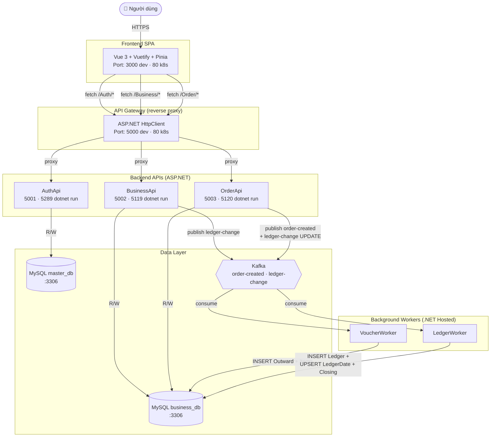
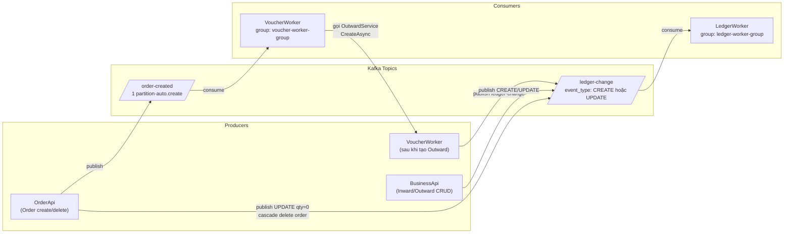
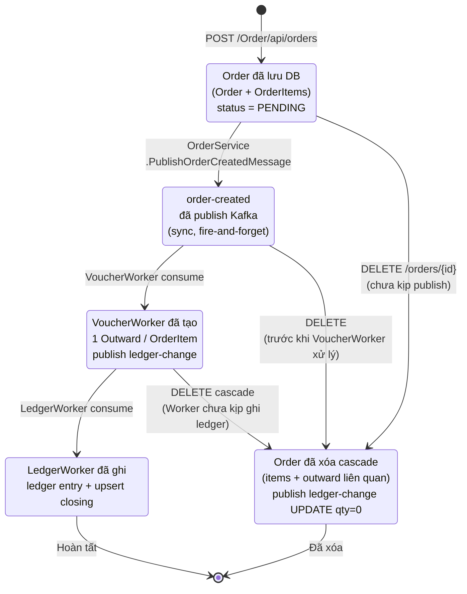
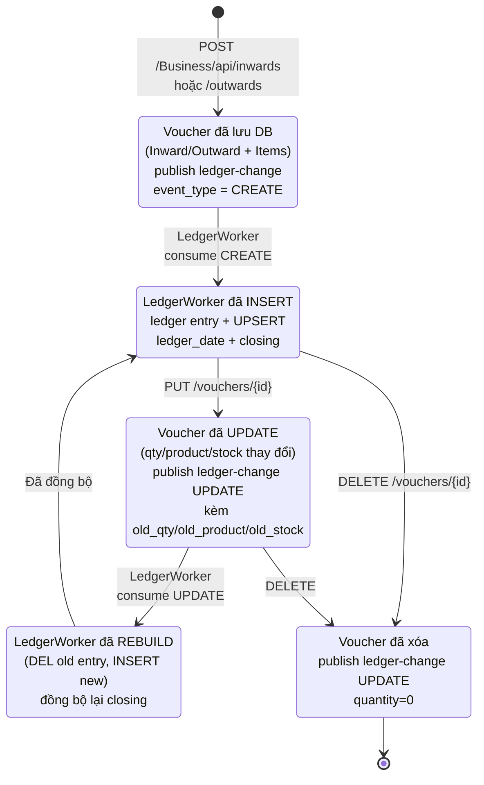
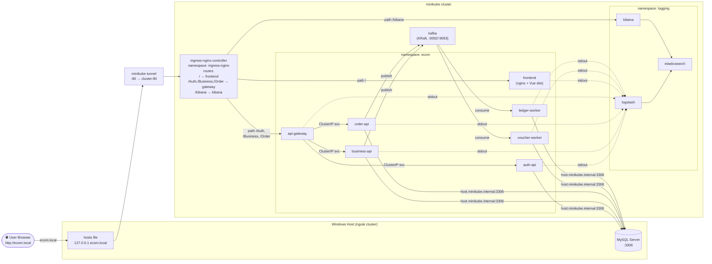

# Diagrams — sơ đồ minh hoạ

File này tập hợp các **Mermaid diagram** minh hoạ kiến trúc và dữ liệu. Mỗi diagram đứng độc lập, kèm ghi chú giải thích ngắn và tham chiếu code thực tế.

## Khi nào xem file này?

- Muốn có **cái nhìn thị giác nhanh** về kiến trúc trước khi đọc chi tiết
- Đang **chuẩn bị slide thuyết trình** hoặc tài liệu báo cáo
- Muốn in ra dán tường để nhìn tổng quan

## Quan hệ với tài liệu khác

| File | Nội dung |
|---|---|
| [`system-context.md`](system-context.md) | Sơ đồ C4 dạng ASCII (3 level: Context → Container → Deployment) |
| [`service-catalog.md`](service-catalog.md) | Catalog 7 thành phần chính, dạng bảng |
| [`communication.md`](communication.md) | Bảng REST endpoints + schema Kafka message |
| [`../01-business/workflows.md`](../01-business/workflows.md) | Sequence diagram ASCII cho 6 workflow (A-F) |
| [`../01-business/data-model.md`](../01-business/data-model.md) | ERD Mermaid đầy đủ 11 bảng |
| **`diagrams.md` (file này)** | Mermaid bổ sung: component overview, Kafka routing, state machines, k8s topology |

---

## 1. Component / system overview

Sơ đồ tổng thể các container và luồng kết nối giữa chúng. Mỗi **mũi tên liền** là HTTP/REST hoặc JDBC; **mũi tên đứt** là Kafka pub/sub.



**Tổng cộng 11 container**: 1 frontend + 1 gateway + 3 API + 2 worker + 2 MySQL + 1 Kafka + 1 (browser/user). Trong k8s, FE/GW cũng là Deployment + Service riêng.

Xem thêm: [`system-context.md`](system-context.md) (C4 chi tiết), [`service-catalog.md`](service-catalog.md).

---

## 2. Kafka topic routing

Ai **produce** topic nào, ai **consume** topic nào. Hệ thống có **2 topic**, mỗi topic có 1 consumer group duy nhất.



**Đặc điểm**:
- Không dùng Kafka Schema Registry — message là JSON snake_case (`backend/Workers/Workers.Shared/Models/`)
- Publish qua `IProducer<string, string>` (key = entity id, value = JSON)
- Consumer đọc bằng `IConsumer<string, string>`, parse JSON, xử lý
- Offset commit **manual** sau khi xử lý thành công (tránh xử lý trùng khi crash)

Xem thêm: [`communication.md § 2. Giao tiếp bất đồng bộ — Kafka`](communication.md#2-giao-tiếp-bất-đồng-bộ--kafka).

---

## 3. Order lifecycle

Vòng đời 1 đơn hàng từ lúc tạo đến khi ledger được ghi (hoặc bị xóa cascade). Mỗi **transition** là 1 lần gọi API hoặc 1 lần Kafka message.



**Code tham chiếu**:
- Tạo order: `backend/BE.Application/Services/Order/OrderService.cs:126-175`
- Publish `order-created`: `OrderService.cs:245-271`
- Cascade delete publish `ledger-change UPDATE qty=0`: `OrderService.RemoveAsync`

**Lưu ý race condition**: nếu user xóa order **trước khi** VoucherWorker kịp consume, các outward có thể đã được tạo nửa chừng → OrderService.RemoveAsync phải query outward liên quan và publish UPDATE qty=0 cho cả những outward đó.

---

## 4. Voucher (Inward / Outward) lifecycle

Vòng đời 1 phiếu nhập hoặc phiếu xuất. Khác với Order, voucher có thể **sửa** và **xóa** — mỗi thao tác đều publish `ledger-change` để worker đồng bộ lại sổ cái.



**Tại sao cần `event_type` và `old_qty`?**

Vì sổ cái là **append-only** (chỉ INSERT, không UPDATE). Khi sửa voucher, worker không thể UPDATE ledger entry cũ — thay vào đó:
1. Insert ledger entry mới với giá trị mới
2. Insert ledger entry **đảo dấu** với `old_qty` để "trừ" entry cũ
3. Recompute `closing` (tồn cuối kỳ)

Nhờ vậy audit trail đầy đủ — biết được ledger entry nào từ phiếu nào, khi nào, với giá trị gì.

Xem thêm: [`../01-business/workflows.md`](../01-business/workflows.md) Workflow E (Sửa phiếu).

---

## 5. Kubernetes deployment topology

Triển khai trên minikube: mỗi service là 1 **Deployment + Service** trong namespace tương ứng. MySQL chạy **ngoài cluster** trên Windows host.



**5 namespace trong cluster**:

| Namespace | Workloads | Mục đích |
|---|---|---|
| `ecom` | 7 Deployments + Services | Toàn bộ backend + frontend |
| `logging` | 3 Deployments (ES, LS, Kibana) | Centralized logging |
| `ingress-nginx` | 1 Deployment | Ingress controller |
| `kubernetes-dashboard` | (auto) | Quản lý cluster qua UI |
| `kube-system` | (auto) | System pods |

**Khác biệt với docker-compose**:
- docker-compose chạy 1 host, tất cả container dùng `localhost` → giao tiếp đơn giản
- k8s phân tán qua Pod IP → phải dùng Service (ClusterIP) + Ingress để routing
- MySQL **phải** chạy ngoài cluster vì image Bitnami đã bị xoá khỏi Docker Hub cuối 2025 (xem memory `project_bitnami_removal.md`)

Xem thêm: [`../03-deployment/k8s-deploy.md`](../03-deployment/k8s-deploy.md) (helm chart structure, scripts, troubleshooting).

---

## 6. Render & xuất diagram

Mermaid render tự động trên:
- **GitHub / GitLab** — preview trực tiếp khi xem file `.md`
- **VS Code** — cài extension `Markdown Preview Mermaid Support`
- **Obsidian / Typora** — render native
- **Online** — paste vào [mermaid.live](https://mermaid.live/) để export PNG/SVG

Diagram này dùng syntax Mermaid **v9+** (compatible với GitHub mặc định). Nếu IDE không render, copy nội dung trong khối ```` ```mermaid ```` ra [mermaid.live](https://mermaid.live/).