# Diagrams — sơ đồ minh hoạ kiến trúc (Chương 2)

File này tập hợp **13 sơ đồ minh hoạ** cho chương "Kiến trúc hệ thống", đánh số theo thứ tự từ tổng quan → chi tiết.

## Quy ước đánh số

Các diagram được đánh số **HÌNH 2.1 → HÌNH 2.13**, dùng để tham chiếu trong báo cáo đồ án.

## Khi nào xem file này?

- Đang viết **báo cáo đồ án** / **luận văn** và cần trích dẫn hình
- Đang **chuẩn bị slide thuyết trình** (export PNG/SVG từ Mermaid)
- Muốn có **cái nhìn thị giác nhanh** về kiến trúc trước khi đọc chi tiết

## Danh sách 13 hình

| Hình | Tiêu đề | Loại Mermaid | Mục đích |
|---|---|---|---|
| [2.1](#hinh-21-so-do-ngu-canh-he-thong--system-context-c4) | System Context C4 | flowchart | Tổng quan: ai tương tác với hệ thống |
| [2.2](#hinh-22-so-do-kien-truc-container--level-2-c4) | Container C4 | flowchart | Các container/process bên trong hệ thống |
| [2.3](#hinh-23-so-do-luong-request-tu-frontend-qua-apigateway-den-cac-backend-api) | Luồng request Frontend → Gateway → APIs | sequenceDiagram | Luồng đồng bộ qua HTTP |
| [2.4](#hinh-24-so-do-quan-he-thuc-the--erd) | ERD | erDiagram | Quan hệ giữa các thực thể chính |
| [2.5](#hinh-25-so-do-luong-request-qua-apigateway) | Luồng request qua ApiGateway | flowchart | Logic routing trong Gateway |
| [2.6](#hinh-26-so-do-luong-kafka-message-giua-cac-service-va-workers) | Kafka flow (topic-level) | flowchart | Producer/consumer cho 2 topic |
| [2.7](#hinh-27-so-do-bang-rest-api-endpoints) | Bảng REST API endpoints | flowchart | Phân nhóm endpoint theo service |
| [2.8](#hinh-28-so-do-luong-message-kafka) | Kafka flow chi tiết (sequence) | sequenceDiagram | Luồng message end-to-end |
| [2.9](#hinh-29-so-do-dependency-giua-cac-layer) | Backend layer dependency | flowchart | Clean Architecture layers |
| [2.10](#hinh-210-so-do-3-kich-ban-trien-khai) | 3 kịch bản triển khai | flowchart | Lựa chọn môi trường chạy |
| [2.11](#hinh-211-kien-truc-docker-compose) | Kiến trúc Docker Compose | flowchart | Triển khai flat trên 1 host |
| [2.12](#hinh-212-kien-truc-kubernetes-tren-minikube) | Kiến trúc Kubernetes minikube | flowchart | Triển khai phân tán trên cluster |
| [2.13](#hinh-213-so-do-cac-namespaces-va-services-trong-kubernetes) | Kubernetes namespaces + services | flowchart | Zoom vào các namespace |

---

## HÌNH 2.1: Sơ đồ ngữ cảnh hệ thống — System Context C4

C4 Level 1: thể hiện hệ thống như 1 **black box**, chỉ quan tâm **ai tương tác với hệ thống** chứ không quan tâm bên trong.

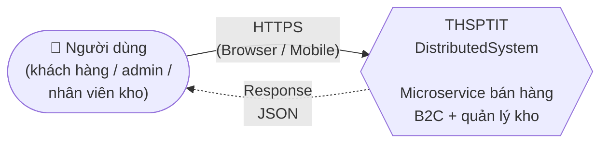

**Phạm vi demo**:
- ✅ Có: web UI (SPA Vue 3) cho người dùng cuối
- ❌ Không có: tích hợp hệ thống ngoài (payment gateway, email service, SSO thật)
- ❌ Không có: app mobile native

**Xem thêm**: [`system-context.md`](system-context.md#level-1--system-context) — chi tiết C4 Level 1.

---

## HÌNH 2.2: Sơ đồ kiến trúc Container — Level 2 C4

C4 Level 2: mỗi **container** = 1 process chạy độc lập (service, worker, database). Đây là view quan trọng nhất khi triển khai.

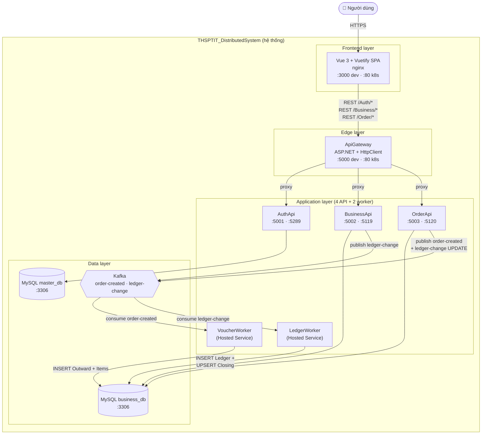

**Tổng cộng 11 container**: 1 FE + 1 GW + 3 API + 2 worker + 2 MySQL + 1 Kafka.

**Xem thêm**: [`system-context.md`](system-context.md#level-2--container), [`service-catalog.md`](service-catalog.md) — port, tech, trách nhiệm từng service.

---

## HÌNH 2.3: Sơ đồ luồng request từ Frontend qua ApiGateway đến các Backend API

Luồng xử lý **đồng bộ qua HTTP** cho 1 request bất kỳ (ví dụ: tạo đơn hàng).

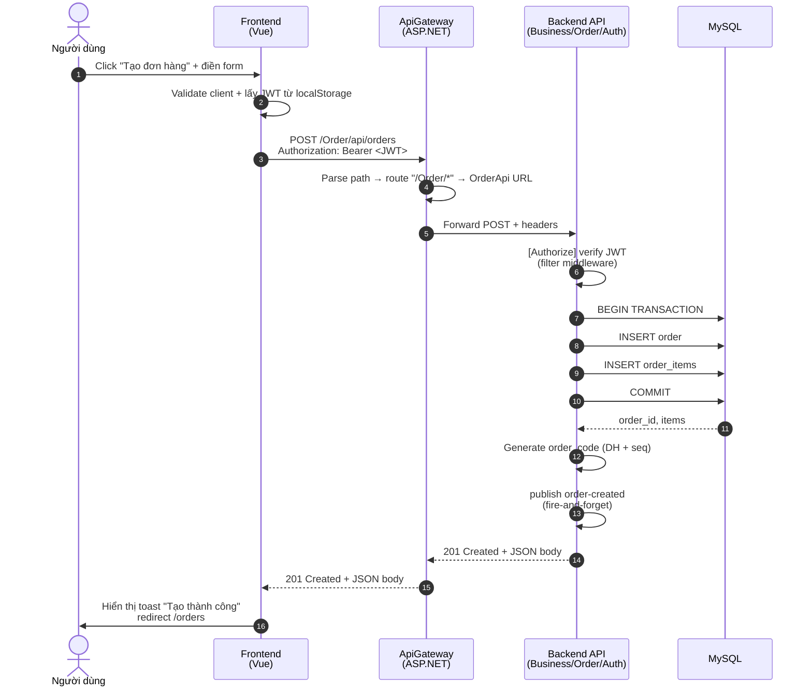

**Đặc điểm**:
- Gateway chỉ **forward**, không xử lý nghiệp vụ
- JWT được verify ở **Backend API** (không phải Gateway) — mỗi service có `[Authorize]` filter riêng
- Kafka publish là **fire-and-forget**: client không đợi worker xử lý

**Xem thêm**: [`communication.md § 1`](communication.md#1-giao-tiep-dong-bo--rest-api) — REST endpoints + auth header.

---

## HÌNH 2.4: Sơ đồ quan hệ thực thể — ERD

ERD rút gọn tập trung vào **luồng chính** (Order → Outward → Ledger). ERD đầy đủ 11 bảng xem tại [`../01-business/data-model.md`](../01-business/data-model.md#so-do-erd).

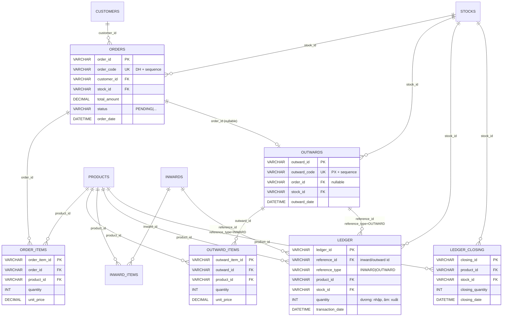

**Quy tắc nghiệp vụ chính**:
- 1 Order → n OrderItem → 1 Outward (có thể) → n OutwardItem → 1 Ledger entry
- Ledger là **append-only**, không UPDATE entry cũ
- `LEDGER_CLOSING.closing_quantity` = tồn kho tại thời điểm `closing_date`

**Xem thêm**: [`../01-business/data-model.md`](../01-business/data-model.md) — schema đầy đủ 11 bảng, index, constraint.

---

## HÌNH 2.5: Sơ đồ luồng request qua ApiGateway

Logic **routing** bên trong ApiGateway: làm sao request `/Auth/*` đến đúng AuthApi, `/Business/*` đến BusinessApi?

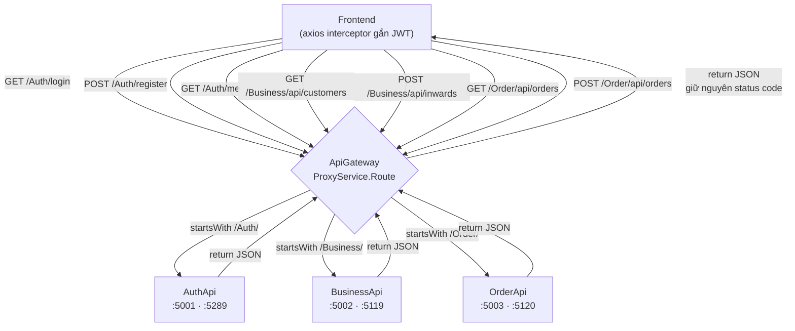

**Code routing** (`backend/ApiGateway/Program.cs`):
- Parse `request.Path` → match prefix `/Auth/`, `/Business/`, `/Order/`
- Lookup URL backend từ config (`Services__AuthApi`, `Services__BusinessApi`, `Services__OrderApi`)
- Copy method, headers, body → `HttpClient.SendAsync`
- Trả response nguyên bản về client

**Không có**: YARP. Không có: load balancing. Không có: circuit breaker.

**Xem thêm**: [`backend-codebase.md`](backend-codebase.md) — chi tiết ApiGateway ở §1 (Tổng quan solution) và §3 (chi tiết từng project).

---

## HÌNH 2.6: Sơ đồ luồng Kafka message giữa các service và workers

View **topic-level**: ai produce, ai consume cho 2 topic `order-created` và `ledger-change`.

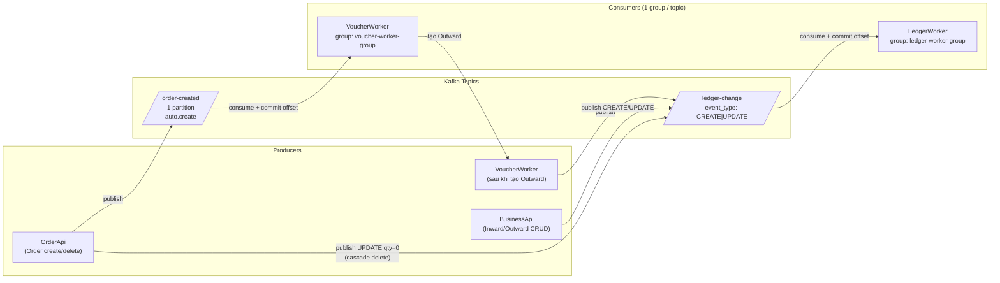

**Đặc điểm**:
- Mỗi topic có **1 consumer group duy nhất** → message được xử lý đúng 1 lần (per group)
- Key = entity id (`order_id`, `ledger_change_id`) → đảm bảo thứ tự xử lý trong cùng partition
- Value = JSON snake_case (`backend/Workers/Workers.Shared/Models/`)
- Offset commit **manual** sau khi xử lý thành công → tránh xử lý trùng khi worker crash

**Xem thêm**: [`communication.md § 2`](communication.md#2-giao-tiep-bat-dong-bo--kafka) — schema message chi tiết.

---

## HÌNH 2.7: Sơ đồ bảng REST API endpoints

Phân nhóm endpoint theo **3 service chính**. Tổng cộng ~36 endpoint.

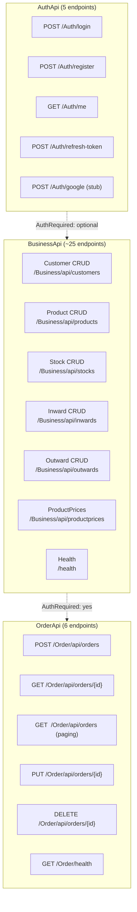

**Quy ước URL**: prefix theo service → gateway dựa vào prefix để route (`HÌNH 2.5`).

**Auth**: mọi endpoint ngoài `/Auth/login` và `/Auth/register` đều yêu cầu `Authorization: Bearer <JWT>`.

**Xem thêm**: [`communication.md § 1.4`](communication.md#14-bang-endpoints-day-du) — bảng đầy đủ 36 endpoint với method, path, auth.

---

## HÌNH 2.8: Sơ đồ luồng message Kafka

Sequence diagram chi tiết cho 1 message đi qua hệ thống — minh hoạ **eventual consistency**.

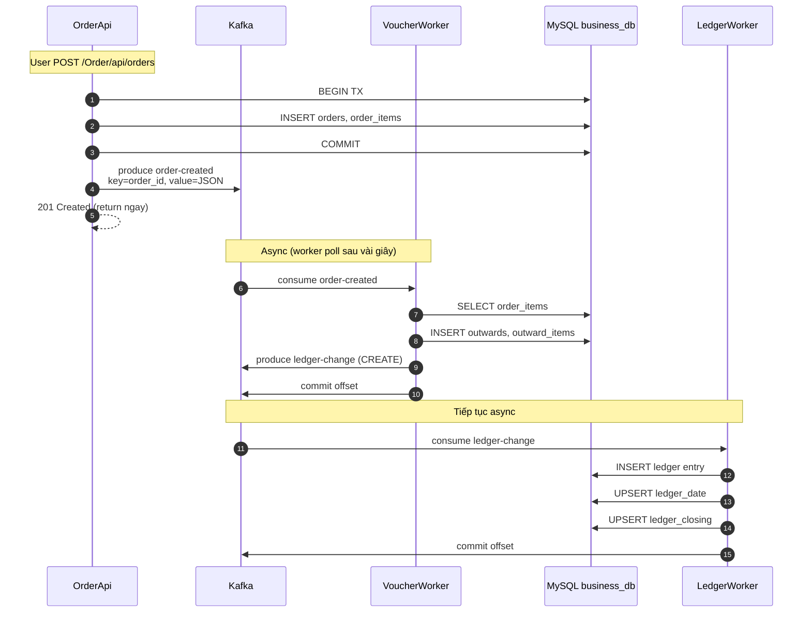

**Đặc điểm**:
- **OrderApi → 201 ngay** — không đợi worker xử lý (latency thấp cho client)
- VoucherWorker + LedgerWorker chạy **async** — có thể mất vài giây
- Nếu worker crash giữa chừng: offset chưa commit → message được redelivery
- Audit trail đầy đủ vì ledger là append-only

**Xem thêm**: [`../01-business/workflows.md`](../01-business/workflows.md) Workflow A → B → C (full text version).

---

## HÌNH 2.9: Sơ đồ dependency giữa các layer

Clean Architecture: project nào tham chiếu project nào. **Quy tắc cứng**: dependency chỉ đi từ ngoài vào trong (Host → Application → Domain).

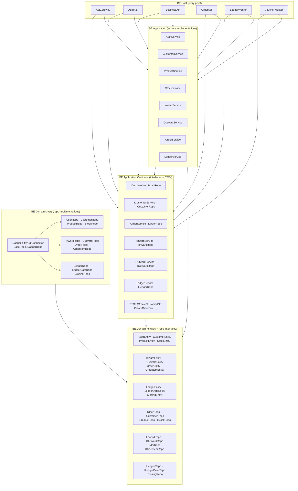

**Quy tắc**:
- **BE.Domain** không tham chiếu gì (trừ BE.Domain.Share cho models share)
- **BE.Application.Contracts** chỉ tham chiếu **BE.Domain** (cho entity + repo interface)
- **BE.Application** tham chiếu **BE.Application.Contracts** + **BE.Domain**
- **BE.Domain.Mysql** tham chiếu **BE.Domain** (impl repo interface)
- **BE.Host** (mỗi API/worker) tham chiếu tất cả các layer trên + **Workers.Shared** (cho Kafka helpers)

**Xem thêm**: [`backend-codebase.md`](backend-codebase.md) — chi tiết từng project, naming convention.

---

## HÌNH 2.10: Sơ đồ 3 kịch bản triển khai

Lựa chọn môi trường chạy hệ thống cho từng mục đích.

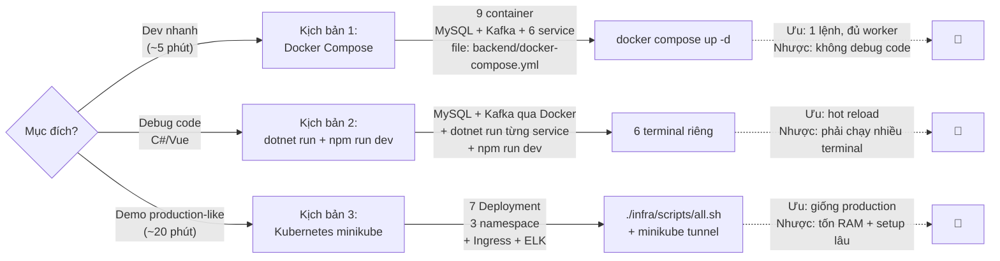

**Ma trận chọn kịch bản**:

| Mục đích | Kịch bản |
|---|---|
| Sửa code backend nhỏ, debug | 2 (dotnet run) |
| Sửa code frontend, hot reload | 2 (npm run dev) |
| Test event-driven flow (Kafka) | 1 (docker compose) |
| Demo cho giảng viên / báo cáo | 3 (k8s) |
| Test ingress / scale / ELK | 3 (k8s) |

**Xem thêm**: [`../03-deployment/README.md`](../03-deployment/README.md) — bảng so sánh chi tiết.

---

## HÌNH 2.11: Kiến trúc Docker Compose

Triển khai **flat** trên 1 host: tất cả container dùng chung network `ecom_default`, giao tiếp qua `localhost:port`.

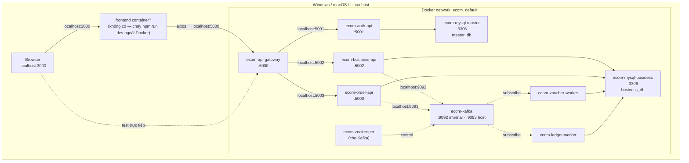

**Lưu ý**:
- **Không có frontend container** trong docker-compose — frontend chạy qua `npm run dev` ở ngoài (Vite proxy trỏ vào gateway port 5000)
- **9 container** được khởi động, mỗi container đều có thể truy cập `localhost`
- **Kafka dual listener**: `:9092` cho container-to-container, `:9093` cho host-to-container
- **Volume mount** `backend/Scripts` → `/docker-entrypoint-initdb.d` để tự động chạy `init.sql` lần đầu

**File**: `backend/docker-compose.yml`

**Xem thêm**: [`../03-deployment/local-dev.md § 1`](../03-deployment/local-dev.md#1-docker-compose-khuyen-nghi-cho-dev).

---

## HÌNH 2.12: Kiến trúc Kubernetes trên minikube

Triển khai **phân tán** trên cluster: mỗi service là 1 Deployment + Service trong namespace, giao tiếp qua ClusterIP + Ingress.

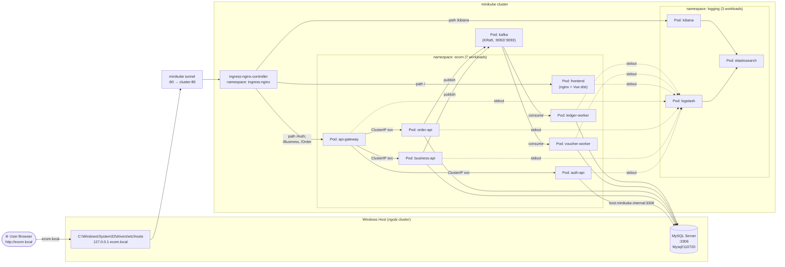

**Khác biệt so với Docker Compose** (`HÌNH 2.11`):
- **Pod IP động** → phải dùng Service (ClusterIP) để giao tiếp
- **Ingress** thay cho reverse proxy ngoài
- **MySQL ngoài cluster** (host.minikube.internal:3306) — vì Bitnami image đã bị xoá khỏi Docker Hub cuối 2025
- **ELK stack** (Elasticsearch + Logstash + Kibana) thay cho log file
- **Helm umbrella chart** `ecom-stack` quản lý 7 subchart local + 1 Kafka custom

**Xem thêm**: [`../03-deployment/k8s-deploy.md`](../03-deployment/k8s-deploy.md).

---

## HÌNH 2.13: Sơ đồ các namespaces và services trong Kubernetes

Zoom vào cluster: liệt kê **Service + Deployment** theo từng namespace.

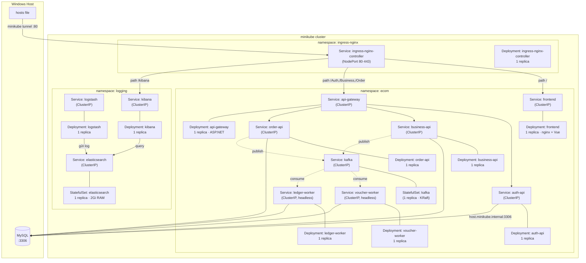

**5 namespace tổng cộng**:

| Namespace | Workloads | Mục đích |
|---|---|---|
| `ecom` | 7 Deployment + 7 Service + 1 StatefulSet (kafka) | Toàn bộ backend + frontend |
| `logging` | 2 Deployment (LS, Kibana) + 1 StatefulSet (ES) | ELK stack |
| `ingress-nginx` | 1 Deployment + 1 Service | Ingress controller |
| `kubernetes-dashboard` | (auto từ minikube addons) | UI quản lý cluster |
| `kube-system` | (auto) | System pods |

**Service type**:
- `ClusterIP` (default) — chỉ truy cập trong cluster
- `NodePort` — ingress-nginx dùng để nhận traffic từ `minikube tunnel`
- Worker + Kafka dùng **headless ClusterIP** (`clusterIP: None`) để client kết nối trực tiếp đến Pod IP

**Xem thêm**: [`../03-deployment/k8s-deploy.md § 8.1`](../03-deployment/k8s-deploy.md#81-namespaces), [`../03-deployment/k8s-deploy.md § 8.2`](../03-deployment/k8s-deploy.md#82-services-trong-namespace-ecom).

---

## Render & xuất diagram

Mermaid render tự động trên:
- **GitHub / GitLab** — preview trực tiếp khi xem file `.md`
- **VS Code** — cài extension `Markdown Preview Mermaid Support`
- **Obsidian / Typora** — render native
- **Online** — paste vào [mermaid.live](https://mermaid.live/) để export PNG/SVG

Diagram dùng syntax Mermaid **v9+** (compatible GitHub mặc định). Nếu IDE không render, copy nội dung trong khối ```` ```mermaid ```` ra [mermaid.live](https://mermaid.live/).

**Trích dẫn trong báo cáo**:

> HÌNH 2.X: tiêu đề (Nguồn: tài liệu đồ án, 2026)

Mỗi hình trong file này có anchor riêng (link trong bảng danh sách ở đầu file), có thể link thẳng tới từng hình trong báo cáo HTML/Markdown.
